# 🏗️ PRINCIPIOS SOLID Y PATRONES DE DISEÑO EN GYMMASTER CLI

## 📋 ÍNDICE
1. [Introducción](#introducción)
2. [Principios SOLID Aplicados](#principios-solid-aplicados)
3. [Patrones de Diseño Implementados](#patrones-de-diseño-implementados)
4. [Arquitectura del Sistema](#arquitectura-del-sistema)
5. [Ejemplos de Código](#ejemplos-de-código)
6. [Beneficios y Conclusiones](#beneficios-y-conclusiones)

---

## 🎯 INTRODUCCIÓN

Este documento presenta un análisis completo de los **Principios SOLID** y **Patrones de Diseño** aplicados en el proyecto **GymMaster CLI**, un sistema de gestión de gimnasio desarrollado en Node.js con MongoDB.

### 🎯 Objetivos del Documento
- **Evidenciar** la aplicación de principios SOLID en el código
- **Documentar** los patrones de diseño implementados
- **Mostrar** ejemplos específicos con ubicaciones en el código
- **Demostrar** las mejores prácticas de desarrollo

---

## 🔧 PRINCIPIOS SOLID APLICADOS

### 1. **S - SINGLE RESPONSIBILITY PRINCIPLE (SRP)**
> *"Una clase debe tener solo una razón para cambiar"*

#### ✅ **Ejemplos Aplicados:**

**📁 Archivo: `services/ClienteService.js`**
```javascript
// Líneas 22-55: Método crearCliente()
async crearCliente(dataCliente) {
    try {
        // SRP: Responsabilidad única de crear clientes
        await this.validarDatosCliente(dataCliente);
        const emailNormalizado = dataCliente.email.toLowerCase().trim();
        const clienteExistente = await this.clienteRepository.getByEmail(emailNormalizado);
        
        if (clienteExistente) {
            throw new Error('Ya existe un cliente registrado con este email');
        }
        
        const cliente = new Cliente(dataCliente);
        const clienteId = await this.clienteRepository.create(cliente);
        const clienteCreado = await this.clienteRepository.getById(clienteId);
        
        return {
            success: true,
            message: 'Cliente creado exitosamente',
            data: clienteCreado.getResumen(),
            clienteId: clienteId
        };
    } catch (error) {
        throw new Error(`Error al crear cliente: ${error.message}`);
    }
}
```

**📁 Archivo: `services/BusquedaService.js`**
```javascript
// Líneas 234-265: Método buscarClientes()
async buscarClientes(termino) {
    try {
        // SRP: Responsabilidad única de búsqueda de clientes
        if (!termino || termino.trim() === '') {
            throw new Error('Término de búsqueda es requerido');
        }
        
        const terminoLimpio = termino.trim().toLowerCase();
        
        if (terminoLimpio.match(/^[0-9a-fA-F]{24}$/)) {
            const cliente = await this.clienteRepository.getById(terminoLimpio);
            if (cliente) {
                return [cliente];
            }
        }
        
        const clientes = await this.clienteRepository.searchClients(terminoLimpio);
        return clientes;
    } catch (error) {
        throw new Error(`Error al buscar clientes: ${error.message}`);
    }
}
```

**📁 Archivo: `models/Cliente.js`**
```javascript
// Líneas 36-44: Método validate()
validate() {
    // SRP: Responsabilidad única de validación de datos del cliente
    this.validateNombre();
    this.validateApellido();
    this.validateEmail();
    this.validateTelefono();
    this.validateFechaRegistro();
    this.validateActivo();
    this.validatePlanes();
}
```

---

### 2. **O - OPEN/CLOSED PRINCIPLE (OCP)**
> *"Las entidades deben estar abiertas para extensión, pero cerradas para modificación"*

#### ✅ **Ejemplos Aplicados:**

**📁 Archivo: `services/BusquedaService.js`**
```javascript
// Líneas 415-446: Método getResumenCliente()
getResumenCliente(cliente) {
    // OCP: Extensible para nuevos tipos de resumen sin modificar el método base
    let nombreCompleto = 'Nombre no disponible';
    
    // Estrategia 1: Usar nombreCompleto si está disponible
    if (cliente.nombreCompleto) {
        nombreCompleto = cliente.nombreCompleto;
    } 
    // Estrategia 2: Construir desde nombre + apellido
    else if (cliente.nombre && cliente.apellido) {
        nombreCompleto = `${cliente.nombre} ${cliente.apellido}`;
    } 
    // Estrategia 3: Usar solo nombre
    else if (cliente.nombre) {
        nombreCompleto = cliente.nombre;
    } 
    // Estrategia 4: Extraer nombre del email
    else if (cliente.email) {
        nombreCompleto = cliente.email.split('@')[0];
    }
    
    return {
        id: cliente.clienteId ? cliente.clienteId.toString() : cliente._id.toString(),
        nombre: nombreCompleto,
        email: cliente.email || 'No registrado',
        telefono: cliente.telefono || 'No registrado',
        activo: cliente.activo ? 'Sí' : 'No'
    };
}
```

**📁 Archivo: `services/ClienteIntegradoService.js`**
```javascript
// Líneas 26-92: Método obtenerClienteCompleto()
async obtenerClienteCompleto(clienteId) {
    try {
        // OCP: Extensible para nuevas funcionalidades sin modificar el método base
        const cliente = await this.clienteRepository.getById(clienteId);
        if (!cliente) {
            throw new Error('Cliente no encontrado');
        }

        // Se pueden agregar nuevos repositorios sin modificar este método
        const contratos = await this.contratoRepository.getByClient(clienteId);
        const planesAsignados = await this.obtenerPlanesAsignados(contratos);
        const seguimientos = await this.seguimientoRepository.getByClient(clienteId);
        const planesNutricionales = await this.nutricionRepository.getByClient(clienteId);
        const planNutricionalActivo = await this.nutricionRepository.getActiveByClient(clienteId);

        return {
            cliente: cliente.getResumen(),
            contratos: contratos.map(contrato => ({
                contratoId: contrato.contratoId.toString(),
                planId: contrato.planId.toString(),
                fechaInicio: contrato.fechaInicio,
                fechaFin: contrato.fechaFin,
                precio: contrato.precio,
                estado: contrato.estado,
                duracionMeses: contrato.duracionMeses
            })),
            // ... más campos que se pueden extender
        };
    } catch (error) {
        throw new Error(`Error al obtener cliente completo: ${error.message}`);
    }
}
```

---

### 3. **L - LISKOV SUBSTITUTION PRINCIPLE (LSP)**
> *"Los objetos de una superclase deben ser reemplazables con objetos de sus subclases"*

#### ✅ **Ejemplos Aplicados:**

**📁 Archivo: `repositories/ClienteRepository.js`**
```javascript
// Líneas 51-67: Método getById()
async getById(id) {
    try {
        if (!ObjectId.isValid(id)) {
            throw new Error('ID del cliente no es válido');
        }

        const clienteDoc = await this.collection.findOne({ _id: new ObjectId(id) });
        
        if (!clienteDoc) {
            return null;
        }

        // LSP: Cualquier implementación de Cliente debe ser sustituible
        return Cliente.fromMongoObject(clienteDoc);
    } catch (error) {
        throw new Error(`Error al obtener cliente: ${error.message}`);
    }
}
```

**📁 Archivo: `models/Cliente.js`**
```javascript
// Líneas 236-247: Método estático fromMongoObject()
static fromMongoObject(mongoDoc) {
    // LSP: Cualquier instancia de Cliente debe ser sustituible
    return new Cliente({
        clienteId: mongoDoc._id,
        nombre: mongoDoc.nombre,
        apellido: mongoDoc.apellido,
        email: mongoDoc.email,
        telefono: mongoDoc.telefono,
        fechaRegistro: mongoDoc.fechaRegistro,
        activo: mongoDoc.activo,
        planes: mongoDoc.planes || []
    });
}
```

---

### 4. **I - INTERFACE SEGREGATION PRINCIPLE (ISP)**
> *"Los clientes no deben depender de interfaces que no usan"*

#### ✅ **Ejemplos Aplicados:**

**📁 Archivo: `services/BusquedaService.js`**
```javascript
// Líneas 415-446: Método getResumenCliente()
getResumenCliente(cliente) {
    // ISP: Solo expone la información necesaria para el resumen
    return {
        id: cliente.clienteId ? cliente.clienteId.toString() : cliente._id.toString(),
        nombre: nombreCompleto,
        email: cliente.email || 'No registrado',
        telefono: cliente.telefono || 'No registrado',
        activo: cliente.activo ? 'Sí' : 'No'
        // No expone campos internos como planes, fechaRegistro, etc.
    };
}
```

**📁 Archivo: `models/Cliente.js`**
```javascript
// Líneas 253-263: Método getResumen()
getResumen() {
    // ISP: Solo expone información pública necesaria
    return {
        clienteId: this.clienteId,
        nombreCompleto: this.getNombreCompleto(),
        email: this.email,
        telefono: this.telefono,
        activo: this.activo,
        cantidadPlanes: this.planes.length,
        fechaRegistro: dayjs(this.fechaRegistro).format('DD/MM/YYYY')
        // No expone métodos internos de validación
    };
}
```

---

### 5. **D - DEPENDENCY INVERSION PRINCIPLE (DIP)**
> *"Depende de abstracciones, no de implementaciones concretas"*

#### ✅ **Ejemplos Aplicados:**

**📁 Archivo: `services/ClienteService.js`**
```javascript
// Líneas 10-14: Constructor
constructor(db) {
    // DIP: Depende de abstracción (db), no de implementación concreta
    this.clienteRepository = new ClienteRepository(db);
    this.db = db;
}
```

**📁 Archivo: `services/BusquedaService.js`**
```javascript
// Líneas 170-177: Constructor
constructor(db) {
    // DIP: Depende de abstracciones (repositorios), no de implementaciones concretas
    this.db = db;
    this.clienteRepository = new ClienteRepository(db);
    this.contratoRepository = new ContratoRepository(db);
}
```

**📁 Archivo: `config/connection.js`**
```javascript
// Líneas 8-12: Clase ConnectionManager
class ConnectionManager {
    constructor() {
        // DIP: Depende de abstracción DatabaseConfig
        this.dbConfig = new DatabaseConfig();
        this.isConnected = false;
    }
}
```

---

## 🎨 PATRONES DE DISEÑO IMPLEMENTADOS

### 1. **REPOSITORY PATTERN**
> *Abstrae el acceso a datos y centraliza la lógica de persistencia*

#### ✅ **Implementación:**

**📁 Archivo: `repositories/ClienteRepository.js`**
```javascript
// Líneas 9-13: Definición de la clase
class ClienteRepository {
    constructor(db) {
        this.collection = db.collection('clientes');
        this.db = db;
    }
    
    // Métodos CRUD encapsulados
    async create(cliente) { /* ... */ }
    async getById(id) { /* ... */ }
    async update(id, updatedData) { /* ... */ }
    async delete(id) { /* ... */ }
}
```

**📁 Archivo: `repositories/index.js`**
```javascript
// Líneas 6-22: Exportación centralizada
const ClienteRepository = require('./ClienteRepository');
const PlanEntrenamientoRepository = require('./PlanEntrenamientoRepository');
const SeguimientoRepository = require('./SeguimientoRepository');
const NutricionRepository = require('./NutricionRepository');
const ContratoRepository = require('./ContratoRepository');
const FinanzasRepository = require('./FinanzasRepository');
const PagoRepository = require('./PagoRepository');

module.exports = {
    ClienteRepository,
    PlanEntrenamientoRepository,
    SeguimientoRepository,
    NutricionRepository,
    ContratoRepository,
    FinanzasRepository,
    PagoRepository
};
```

---

### 2. **SERVICE LAYER PATTERN**
> *Encapsula la lógica de negocio y actúa como intermediario*

#### ✅ **Implementación:**

**📁 Archivo: `services/ClienteService.js`**
```javascript
// Líneas 10-14: Constructor del servicio
class ClienteService {
    constructor(db) {
        this.clienteRepository = new ClienteRepository(db);
        this.db = db;
    }
    
    // Lógica de negocio encapsulada
    async crearCliente(dataCliente) { /* ... */ }
    async listarClientes(filtro, opciones) { /* ... */ }
    async actualizarCliente(id, datosActualizados) { /* ... */ }
    async eliminarCliente(id, forzarEliminacion) { /* ... */ }
}
```

**📁 Archivo: `services/index.js`**
```javascript
// Líneas 6-32: Exportación centralizada de servicios
const ClienteService = require('./ClienteService');
const PlanClienteService = require('./PlanClienteService');
const PlanEntrenamientoService = require('./PlanEntrenamientoService');
const ContratoService = require('./ContratoService');
const SeguimientoService = require('./SeguimientoService');
const ProgresoService = require('./ProgresoService');
const NutricionService = require('./NutricionService');
const BusquedaService = require('./BusquedaService');
const PlantillasNutricionService = require('./PlantillasNutricionService');
const ClienteIntegradoService = require('./ClienteIntegradoService');
const FinanzasService = require('./FinanzasService');
const ReportesService = require('./ReportesService');

module.exports = {
    ClienteService,
    PlanClienteService,
    PlanEntrenamientoService,
    ContratoService,
    SeguimientoService,
    ProgresoService,
    NutricionService,
    BusquedaService,
    PlantillasNutricionService,
    ClienteIntegradoService,
    FinanzasService,
    ReportesService
};
```

---

### 3. **SINGLETON PATTERN**
> *Asegura una sola instancia de una clase*

#### ✅ **Implementación:**

**📁 Archivo: `config/connection.js`**
```javascript
// Líneas 8-106: Implementación del Singleton
class ConnectionManager {
    constructor() {
        this.dbConfig = new DatabaseConfig();
        this.isConnected = false;
    }
    
    async initialize() {
        try {
            if (this.isConnected) {
                return { client: this.dbConfig.client, db: this.dbConfig.db };
            }
            
            const connection = await this.dbConfig.connect();
            this.isConnected = true;
            
            await this.createIndexes(connection.db);
            return connection;
        } catch (error) {
            console.error('❌ Error al inicializar conexión:', error.message);
            throw error;
        }
    }
    
    // ... más métodos
}

// Exportar instancia singleton
module.exports = new ConnectionManager();
```

---

### 4. **FACADE PATTERN**
> *Proporciona una interfaz simplificada para un subsistema complejo*

#### ✅ **Implementación:**

**📁 Archivo: `services/ClienteIntegradoService.js`**
```javascript
// Líneas 11-19: Constructor del Facade
class ClienteIntegradoService {
    constructor(db) {
        this.db = db;
        // Facade: Oculta la complejidad de múltiples repositorios
        this.clienteRepository = new ClienteRepository(db);
        this.planEntrenamientoRepository = new PlanEntrenamientoRepository(db);
        this.contratoRepository = new ContratoRepository(db);
        this.seguimientoRepository = new SeguimientoRepository(db);
        this.nutricionRepository = new NutricionRepository(db);
    }
    
    // Método que simplifica operaciones complejas
    async obtenerClienteCompleto(clienteId) {
        // Facade: Un solo método que coordina múltiples operaciones
        const cliente = await this.clienteRepository.getById(clienteId);
        const contratos = await this.contratoRepository.getByClient(clienteId);
        const planesAsignados = await this.obtenerPlanesAsignados(contratos);
        const seguimientos = await this.seguimientoRepository.getByClient(clienteId);
        const planesNutricionales = await this.nutricionRepository.getByClient(clienteId);
        
        return {
            cliente: cliente.getResumen(),
            contratos: contratos.map(/* ... */),
            planesAsignados: planesAsignados,
            seguimientos: seguimientos.map(/* ... */),
            planesNutricionales: planesNutricionales.map(/* ... */)
        };
    }
}
```

---

### 5. **STRATEGY PATTERN**
> *Define una familia de algoritmos, los encapsula y los hace intercambiables*

#### ✅ **Implementación:**

**📁 Archivo: `services/BusquedaService.js`**
```javascript
// Líneas 234-265: Estrategias de búsqueda
async buscarClientes(termino) {
    try {
        if (!termino || termino.trim() === '') {
            throw new Error('Término de búsqueda es requerido');
        }
        
        const terminoLimpio = termino.trim().toLowerCase();
        
        // Strategy: Estrategia de búsqueda por ID
        if (terminoLimpio.match(/^[0-9a-fA-F]{24}$/)) {
            const cliente = await this.clienteRepository.getById(terminoLimpio);
            if (cliente) {
                return [cliente];
            }
        }
        
        // Strategy: Estrategia de búsqueda por nombre
        const clientes = await this.clienteRepository.searchClients(terminoLimpio);
        return clientes;
    } catch (error) {
        throw new Error(`Error al buscar clientes: ${error.message}`);
    }
}
```

**📁 Archivo: `services/BusquedaService.js`**
```javascript
// Líneas 415-446: Estrategias de construcción de nombre
getResumenCliente(cliente) {
    // Strategy: Diferentes estrategias para construir el nombre
    let nombreCompleto = 'Nombre no disponible';
    
    // Estrategia 1: Usar nombreCompleto si está disponible
    if (cliente.nombreCompleto) {
        nombreCompleto = cliente.nombreCompleto;
    } 
    // Estrategia 2: Construir desde nombre + apellido
    else if (cliente.nombre && cliente.apellido) {
        nombreCompleto = `${cliente.nombre} ${cliente.apellido}`;
    } 
    // Estrategia 3: Usar solo nombre
    else if (cliente.nombre) {
        nombreCompleto = cliente.nombre;
    } 
    // Estrategia 4: Extraer nombre del email
    else if (cliente.email) {
        nombreCompleto = cliente.email.split('@')[0];
    }
    
    return {
        id: cliente.clienteId ? cliente.clienteId.toString() : cliente._id.toString(),
        nombre: nombreCompleto,
        email: cliente.email || 'No registrado',
        telefono: cliente.telefono || 'No registrado',
        activo: cliente.activo ? 'Sí' : 'No'
    };
}
```

---

### 6. **DEPENDENCY INJECTION PATTERN**
> *Inyecta dependencias en lugar de crearlas internamente*

#### ✅ **Implementación:**

**📁 Archivo: `services/ClienteService.js`**
```javascript
// Líneas 10-14: Inyección de dependencias
constructor(db) {
    // DI: Inyección de dependencia db
    this.clienteRepository = new ClienteRepository(db);
    this.db = db;
}
```

**📁 Archivo: `services/BusquedaService.js`**
```javascript
// Líneas 170-177: Inyección de dependencias
constructor(db) {
    // DI: Inyección de dependencia db
    this.db = db;
    this.clienteRepository = new ClienteRepository(db);
    this.contratoRepository = new ContratoRepository(db);
}
```

**📁 Archivo: `cli/MenuPrincipal.js`**
```javascript
// Líneas 16-27: Inyección de dependencias
class MenuPrincipal {
    constructor(db) {
        // DI: Inyección de dependencia db a todos los CLI
        this.db = db;
        this.clienteCLI = new ClienteCLI(db);
        this.planEntrenamientoCLI = new PlanEntrenamientoCLI(db);
        this.contratoCLI = new ContratoCLI(db);
        this.seguimientoCLI = new SeguimientoCLI(db);
        this.nutricionCLI = new NutricionCLI(db);
        this.finanzasCLI = new FinanzasCLI(db);
        this.reportesCLI = new ReportesCLI(db);
        this.configCLI = new ConfigCLI(db);
    }
}
```

---

### 7. **MODULE PATTERN**
> *Encapsula funcionalidad relacionada en módulos*

#### ✅ **Implementación:**

**📁 Archivo: `models/index.js`**
```javascript
// Líneas 6-22: Módulo de modelos
const Cliente = require('./Cliente');
const PlanEntrenamiento = require('./PlanEntrenamiento');
const Seguimiento = require('./Seguimiento');
const Nutricion = require('./Nutricion');
const Contrato = require('./Contrato');
const Finanzas = require('./Finanzas');
const Pago = require('./Pago');

module.exports = {
    Cliente,
    PlanEntrenamiento,
    Seguimiento,
    Nutricion,
    Contrato,
    Finanzas,
    Pago
};
```

**📁 Archivo: `services/index.js`**
```javascript
// Líneas 6-32: Módulo de servicios
const ClienteService = require('./ClienteService');
const PlanClienteService = require('./PlanClienteService');
const PlanEntrenamientoService = require('./PlanEntrenamientoService');
const ContratoService = require('./ContratoService');
const SeguimientoService = require('./SeguimientoService');
const ProgresoService = require('./ProgresoService');
const NutricionService = require('./NutricionService');
const BusquedaService = require('./BusquedaService');
const PlantillasNutricionService = require('./PlantillasNutricionService');
const ClienteIntegradoService = require('./ClienteIntegradoService');
const FinanzasService = require('./FinanzasService');
const ReportesService = require('./ReportesService');

module.exports = {
    ClienteService,
    PlanClienteService,
    PlanEntrenamientoService,
    ContratoService,
    SeguimientoService,
    ProgresoService,
    NutricionService,
    BusquedaService,
    PlantillasNutricionService,
    ClienteIntegradoService,
    FinanzasService,
    ReportesService
};
```

---

## 🏗️ ARQUITECTURA DEL SISTEMA

### 📊 **Diagrama de Arquitectura**

```mermaid
graph TB
    %% Capa de Presentación
    subgraph "🖥️ Capa de Presentación"
        CLI[CLI Interface]
        MENU[Menu Principal]
        CLI_CLIENTE[Cliente CLI]
        CLI_PLAN[Plan CLI]
        CLI_SEGUIMIENTO[Seguimiento CLI]
        CLI_NUTRICION[Nutrición CLI]
        CLI_CONTRATO[Contrato CLI]
        CLI_FINANZAS[Finanzas CLI]
        CLI_REPORTES[Reportes CLI]
    end
    
    %% Capa de Servicios
    subgraph "⚙️ Capa de Servicios"
        SERVICE_CLIENTE[Cliente Service]
        SERVICE_PLAN[Plan Service]
        SERVICE_SEGUIMIENTO[Seguimiento Service]
        SERVICE_NUTRICION[Nutrición Service]
        SERVICE_CONTRATO[Contrato Service]
        SERVICE_FINANZAS[Finanzas Service]
        SERVICE_REPORTES[Reportes Service]
        SERVICE_BUSQUEDA[Búsqueda Service]
        SERVICE_PROGRESO[Progreso Service]
    end
    
    %% Capa de Repositorios
    subgraph "🗄️ Capa de Repositorios"
        REPO_CLIENTE[Cliente Repository]
        REPO_PLAN[Plan Repository]
        REPO_SEGUIMIENTO[Seguimiento Repository]
        REPO_NUTRICION[Nutrición Repository]
        REPO_CONTRATO[Contrato Repository]
        REPO_FINANZAS[Finanzas Repository]
        REPO_PAGO[Pago Repository]
    end
    
    %% Capa de Modelos
    subgraph "📋 Capa de Modelos"
        MODEL_CLIENTE[Cliente Model]
        MODEL_PLAN[Plan Model]
        MODEL_SEGUIMIENTO[Seguimiento Model]
        MODEL_NUTRICION[Nutrición Model]
        MODEL_CONTRATO[Contrato Model]
        MODEL_FINANZAS[Finanzas Model]
        MODEL_PAGO[Pago Model]
    end
    
    %% Base de Datos
    subgraph "💾 Persistencia"
        MONGODB[(MongoDB Database)]
        COLLECTIONS[Collections]
        INDEXES[Índices]
        TRANSACTIONS[Transacciones]
    end
    
    %% Configuración
    subgraph "⚙️ Configuración"
        CONFIG[Config Manager]
        CONNECTION[Connection Manager]
        DATABASE[Database Config]
    end
    
    %% Conexiones
    CLI --> MENU
    MENU --> CLI_CLIENTE
    MENU --> CLI_PLAN
    MENU --> CLI_SEGUIMIENTO
    MENU --> CLI_NUTRICION
    MENU --> CLI_CONTRATO
    MENU --> CLI_FINANZAS
    MENU --> CLI_REPORTES
    
    CLI_CLIENTE --> SERVICE_CLIENTE
    CLI_PLAN --> SERVICE_PLAN
    CLI_SEGUIMIENTO --> SERVICE_SEGUIMIENTO
    CLI_NUTRICION --> SERVICE_NUTRICION
    CLI_CONTRATO --> SERVICE_CONTRATO
    CLI_FINANZAS --> SERVICE_FINANZAS
    CLI_REPORTES --> SERVICE_REPORTES
    
    SERVICE_CLIENTE --> REPO_CLIENTE
    SERVICE_PLAN --> REPO_PLAN
    SERVICE_SEGUIMIENTO --> REPO_SEGUIMIENTO
    SERVICE_NUTRICION --> REPO_NUTRICION
    SERVICE_CONTRATO --> REPO_CONTRATO
    SERVICE_FINANZAS --> REPO_FINANZAS
    SERVICE_REPORTES --> REPO_PAGO
    
    REPO_CLIENTE --> MODEL_CLIENTE
    REPO_PLAN --> MODEL_PLAN
    REPO_SEGUIMIENTO --> MODEL_SEGUIMIENTO
    REPO_NUTRICION --> MODEL_NUTRICION
    REPO_CONTRATO --> MODEL_CONTRATO
    REPO_FINANZAS --> MODEL_FINANZAS
    REPO_PAGO --> MODEL_PAGO
    
    REPO_CLIENTE --> MONGODB
    REPO_PLAN --> MONGODB
    REPO_SEGUIMIENTO --> MONGODB
    REPO_NUTRICION --> MONGODB
    REPO_CONTRATO --> MONGODB
    REPO_FINANZAS --> MONGODB
    REPO_PAGO --> MONGODB
    
    CONFIG --> CONNECTION
    CONNECTION --> DATABASE
    DATABASE --> MONGODB
```



### 🔄 **Flujo de Datos**

```
CLI Interface → Service Layer → Repository Layer → MongoDB
     ↓              ↓              ↓              ↓
  Validación    Lógica de      Abstracción    Persistencia
  de entrada    Negocio        de Datos       de Datos
```

---

## 📝 EJEMPLOS DE CÓDIGO

### 🎯 **Ejemplo 1: Aplicación de SRP en ClienteService**

**📁 Archivo: `services/ClienteService.js` (Líneas 22-55)**

```javascript
/**
 * Crea un nuevo cliente con validaciones de negocio
 * SRP: Responsabilidad única de crear clientes
 */
async crearCliente(dataCliente) {
    try {
        // Validaciones de negocio adicionales
        await this.validarDatosCliente(dataCliente);
        
        // Normalizar email para consistencia
        const emailNormalizado = dataCliente.email.toLowerCase().trim();
        
        // Verificar que no exista un cliente con el mismo email
        const clienteExistente = await this.clienteRepository.getByEmail(emailNormalizado);
        
        if (clienteExistente) {
            throw new Error('Ya existe un cliente registrado con este email');
        }

        // Crear instancia del modelo con validaciones
        const cliente = new Cliente(dataCliente);
        
        // Persistir en la base de datos
        const clienteId = await this.clienteRepository.create(cliente);
        
        // Obtener el cliente creado para retornar información completa
        const clienteCreado = await this.clienteRepository.getById(clienteId);
        
        return {
            success: true,
            message: 'Cliente creado exitosamente',
            data: clienteCreado.getResumen(),
            clienteId: clienteId
        };
    } catch (error) {
        throw new Error(`Error al crear cliente: ${error.message}`);
    }
}
```

### 🎯 **Ejemplo 2: Aplicación de DIP en BusquedaService**

**📁 Archivo: `services/BusquedaService.js` (Líneas 170-177)**

```javascript
/**
 * Constructor del servicio de búsqueda
 * DIP: Depende de abstracciones (repositorios), no de implementaciones concretas
 */
constructor(db) {
    // DIP: Almacenar abstracción de base de datos
    this.db = db;
    
    // DIP: Crear instancias de repositorios (abstracciones)
    this.clienteRepository = new ClienteRepository(db);
    this.contratoRepository = new ContratoRepository(db);
}
```

### 🎯 **Ejemplo 3: Aplicación de Strategy Pattern**

**📁 Archivo: `services/BusquedaService.js` (Líneas 415-446)**

```javascript
/**
 * Genera un resumen estructurado de un cliente
 * Strategy Pattern: Diferentes estrategias para construir el nombre
 */
getResumenCliente(cliente) {
    // Strategy: Construir nombre completo usando diferentes estrategias
    let nombreCompleto = 'Nombre no disponible';
    
    // Estrategia 1: Usar nombreCompleto si está disponible
    if (cliente.nombreCompleto) {
        nombreCompleto = cliente.nombreCompleto;
    } 
    // Estrategia 2: Construir desde nombre + apellido
    else if (cliente.nombre && cliente.apellido) {
        nombreCompleto = `${cliente.nombre} ${cliente.apellido}`;
    } 
    // Estrategia 3: Usar solo nombre
    else if (cliente.nombre) {
        nombreCompleto = cliente.nombre;
    } 
    // Estrategia 4: Extraer nombre del email
    else if (cliente.email) {
        nombreCompleto = cliente.email.split('@')[0];
    }
    
    return {
        id: cliente.clienteId ? cliente.clienteId.toString() : cliente._id.toString(),
        nombre: nombreCompleto,
        email: cliente.email || 'No registrado',
        telefono: cliente.telefono || 'No registrado',
        activo: cliente.activo ? 'Sí' : 'No'
    };
}
```

### 🎯 **Ejemplo 4: Aplicación de Repository Pattern**

**📁 Archivo: `repositories/ClienteRepository.js` (Líneas 21-43)**

```javascript
/**
 * Crea un nuevo cliente en la base de datos
 * Repository Pattern: Abstrae el acceso a datos
 */
async create(cliente) {
    try {
        // Validar que sea una instancia de Cliente
        if (!(cliente instanceof Cliente)) {
            throw new Error('El parámetro debe ser una instancia de Cliente');
        }

        // Convertir a objeto MongoDB
        const clienteDoc = cliente.toMongoObject();
        
        // Verificar que no exista un cliente con el mismo email
        const clienteExistente = await this.collection.findOne({ email: clienteDoc.email });
        if (clienteExistente) {
            throw new Error('Ya existe un cliente con este email');
        }

        // Insertar en la base de datos
        const result = await this.collection.insertOne(clienteDoc);
        return result.insertedId;
    } catch (error) {
        throw new Error(`Error al crear cliente: ${error.message}`);
    }
}
```

### 🎯 **Ejemplo 5: Aplicación de Singleton Pattern**

**📁 Archivo: `config/connection.js` (Líneas 8-106)**

```javascript
/**
 * Singleton para manejar la conexión a MongoDB
 * Asegura una sola instancia de conexión en toda la aplicación
 */
class ConnectionManager {
    constructor() {
        this.dbConfig = new DatabaseConfig();
        this.isConnected = false;
    }

    /**
     * Inicializa la conexión a MongoDB
     * Singleton: Asegura una sola instancia
     */
    async initialize() {
        try {
            if (this.isConnected) {
                return { client: this.dbConfig.client, db: this.dbConfig.db };
            }

            const connection = await this.dbConfig.connect();
            this.isConnected = true;
            
            // Crear índices básicos para optimizar consultas
            await this.createIndexes(connection.db);
            
            return connection;
        } catch (error) {
            console.error('❌ Error al inicializar conexión:', error.message);
            throw error;
        }
    }
    
    // ... más métodos
}

// Exportar instancia singleton
module.exports = new ConnectionManager();
```

---

## 🎯 BENEFICIOS Y CONCLUSIONES

### ✅ **Beneficios de los Principios SOLID**

1. **Mantenibilidad**: Código más fácil de mantener y modificar
2. **Testabilidad**: Componentes más fáciles de probar
3. **Extensibilidad**: Fácil agregar nuevas funcionalidades
4. **Reutilización**: Componentes reutilizables en diferentes contextos
5. **Separación de Responsabilidades**: Cada clase tiene una responsabilidad específica

### ✅ **Beneficios de los Patrones de Diseño**

1. **Repository Pattern**: Abstracción del acceso a datos
2. **Service Layer**: Encapsulación de la lógica de negocio
3. **Singleton**: Gestión centralizada de recursos
4. **Facade**: Simplificación de interfaces complejas
5. **Strategy**: Flexibilidad en algoritmos
6. **Dependency Injection**: Desacoplamiento de dependencias
7. **Module Pattern**: Organización modular del código

### 📊 **Resumen de Aplicación**

| **Principio/Patrón** | **Archivos Aplicados** | **Líneas** | **Beneficio** |
|----------------------|------------------------|------------|---------------|
| **SRP** | `ClienteService.js` | 22-55 | Responsabilidad única |
| **OCP** | `BusquedaService.js` | 415-446 | Extensibilidad |
| **LSP** | `ClienteRepository.js` | 51-67 | Sustituibilidad |
| **ISP** | `BusquedaService.js` | 415-446 | Interfaces específicas |
| **DIP** | `BusquedaService.js` | 170-177 | Dependencias abstractas |
| **Repository** | `ClienteRepository.js` | 21-43 | Abstracción de datos |
| **Service Layer** | `ClienteService.js` | 10-14 | Lógica de negocio |
| **Singleton** | `connection.js` | 8-106 | Instancia única |
| **Facade** | `ClienteIntegradoService.js` | 11-19 | Interfaz simplificada |
| **Strategy** | `BusquedaService.js` | 415-446 | Algoritmos intercambiables |
| **DI** | `ClienteService.js` | 10-14 | Inyección de dependencias |
| **Module** | `index.js` | 6-32 | Organización modular |

### 🎯 **Conclusiones**

El proyecto **GymMaster CLI** demuestra una **excelente aplicación** de principios SOLID y patrones de diseño, resultando en:

- **Código mantenible** y fácil de entender
- **Arquitectura escalable** y extensible
- **Separación clara** de responsabilidades
- **Reutilización** de componentes
- **Testabilidad** mejorada
- **Flexibilidad** para futuras modificaciones

Esta implementación sirve como un **ejemplo práctico** de cómo aplicar principios de diseño de software para crear sistemas robustos, mantenibles y escalables.

---

## 📚 **REFERENCIAS**

- **Principios SOLID**: Robert C. Martin (Uncle Bob)
- **Patrones de Diseño**: Gang of Four (GoF)
- **Clean Architecture**: Robert C. Martin
- **Node.js Best Practices**: Node.js Foundation

---

*Documento generado para el proyecto GymMaster CLI - Sistema de Gestión de Gimnasio*
