# 🏗️ PRINCIPIOS SOLID Y PATRONES DE DISEÑO EN GYMMASTER CLI

## 📋 ÍNDICE
1. [Introducción](#introducción)
2. [Principios SOLID - Explicación Detallada](#principios-solid---explicación-detallada)
3. [Patrones de Diseño - Explicación Completa](#patrones-de-diseño---explicación-completa)
4. [Análisis por Archivos del Proyecto](#análisis-por-archivos-del-proyecto)
5. [Arquitectura del Sistema](#arquitectura-del-sistema)
6. [Ejemplos de Código Específicos](#ejemplos-de-código-específicos)
7. [Beneficios y Conclusiones](#beneficios-y-conclusiones)

---

## 🎯 INTRODUCCIÓN

Este documento presenta un análisis completo de los **Principios SOLID** y **Patrones de Diseño** aplicados en el proyecto **GymMaster CLI**, un sistema de gestión de gimnasio desarrollado en Node.js con MongoDB.

### 🎯 Objetivos del Documento
- **Evidenciar** la aplicación de principios SOLID en el código
- **Documentar** los patrones de diseño implementados
- **Mostrar** ejemplos específicos con ubicaciones en el código
- **Demostrar** las mejores prácticas de desarrollo

---

## 🔧 PRINCIPIOS SOLID - EXPLICACIÓN DETALLADA

### 1. **S - SINGLE RESPONSIBILITY PRINCIPLE (SRP)**
> *"Una clase debe tener solo una razón para cambiar"*

#### 📚 **¿Qué significa SRP?**
El Principio de Responsabilidad Única establece que cada clase debe tener **una sola razón para cambiar**. Esto significa que:

- **Una clase = Una responsabilidad**
- **Un cambio = Una clase afectada**
- **Separación clara de responsabilidades**
- **Código más mantenible y testeable**

#### 🎯 **Beneficios del SRP:**
- **Mantenibilidad**: Fácil localizar y corregir errores
- **Testabilidad**: Tests más simples y específicos
- **Reutilización**: Componentes más pequeños y enfocados
- **Extensibilidad**: Fácil agregar nuevas funcionalidades

#### ✅ **Ejemplos Aplicados en el Proyecto:**

**📁 Archivo: `services/ClienteService.js` (Líneas 22-55)**
```javascript
/**
 * Crea un nuevo cliente con validaciones de negocio
 * SRP: Responsabilidad única de crear clientes
 * - Solo se encarga de la lógica de creación de clientes
 * - No maneja persistencia (delegado a ClienteRepository)
 * - No maneja presentación (delegado a CLI)
 */
async crearCliente(dataCliente) {
    try {
        // SRP: Responsabilidad única de crear clientes
        await this.validarDatosCliente(dataCliente);
        const emailNormalizado = dataCliente.email.toLowerCase().trim();
        const clienteExistente = await this.clienteRepository.getByEmail(emailNormalizado);
        
        if (clienteExistente) {
            throw new Error('Ya existe un cliente registrado con este email');
        }
        
        const cliente = new Cliente(dataCliente);
        const clienteId = await this.clienteRepository.create(cliente);
        const clienteCreado = await this.clienteRepository.getById(clienteId);
        
        return {
            success: true,
            message: 'Cliente creado exitosamente',
            data: clienteCreado.getResumen(),
            clienteId: clienteId
        };
    } catch (error) {
        throw new Error(`Error al crear cliente: ${error.message}`);
    }
}
```

**🔍 Análisis SRP en ClienteService:**
- ✅ **Responsabilidad única**: Solo maneja lógica de negocio de clientes
- ✅ **Separación clara**: No maneja persistencia ni presentación
- ✅ **Una razón para cambiar**: Solo cambia si cambia la lógica de creación de clientes
- ✅ **Delegación correcta**: Usa repositorios para persistencia

**📁 Archivo: `services/BusquedaService.js`**
```javascript
// Líneas 234-265: Método buscarClientes()
async buscarClientes(termino) {
    try {
        // SRP: Responsabilidad única de búsqueda de clientes
        if (!termino || termino.trim() === '') {
            throw new Error('Término de búsqueda es requerido');
        }
        
        const terminoLimpio = termino.trim().toLowerCase();
        
        if (terminoLimpio.match(/^[0-9a-fA-F]{24}$/)) {
            const cliente = await this.clienteRepository.getById(terminoLimpio);
            if (cliente) {
                return [cliente];
            }
        }
        
        const clientes = await this.clienteRepository.searchClients(terminoLimpio);
        return clientes;
    } catch (error) {
        throw new Error(`Error al buscar clientes: ${error.message}`);
    }
}
```

**📁 Archivo: `models/Cliente.js`**
```javascript
// Líneas 36-44: Método validate()
validate() {
    // SRP: Responsabilidad única de validación de datos del cliente
    this.validateNombre();
    this.validateApellido();
    this.validateEmail();
    this.validateTelefono();
    this.validateFechaRegistro();
    this.validateActivo();
    this.validatePlanes();
}
```

---

### 2. **O - OPEN/CLOSED PRINCIPLE (OCP)**
> *"Las entidades deben estar abiertas para extensión, pero cerradas para modificación"*

#### ✅ **Ejemplos Aplicados:**

**📁 Archivo: `services/BusquedaService.js`**
```javascript
// Líneas 415-446: Método getResumenCliente()
getResumenCliente(cliente) {
    // OCP: Extensible para nuevos tipos de resumen sin modificar el método base
    let nombreCompleto = 'Nombre no disponible';
    
    // Estrategia 1: Usar nombreCompleto si está disponible
    if (cliente.nombreCompleto) {
        nombreCompleto = cliente.nombreCompleto;
    } 
    // Estrategia 2: Construir desde nombre + apellido
    else if (cliente.nombre && cliente.apellido) {
        nombreCompleto = `${cliente.nombre} ${cliente.apellido}`;
    } 
    // Estrategia 3: Usar solo nombre
    else if (cliente.nombre) {
        nombreCompleto = cliente.nombre;
    } 
    // Estrategia 4: Extraer nombre del email
    else if (cliente.email) {
        nombreCompleto = cliente.email.split('@')[0];
    }
    
    return {
        id: cliente.clienteId ? cliente.clienteId.toString() : cliente._id.toString(),
        nombre: nombreCompleto,
        email: cliente.email || 'No registrado',
        telefono: cliente.telefono || 'No registrado',
        activo: cliente.activo ? 'Sí' : 'No'
    };
}
```

**📁 Archivo: `services/ClienteIntegradoService.js`**
```javascript
// Líneas 26-92: Método obtenerClienteCompleto()
async obtenerClienteCompleto(clienteId) {
    try {
        // OCP: Extensible para nuevas funcionalidades sin modificar el método base
        const cliente = await this.clienteRepository.getById(clienteId);
        if (!cliente) {
            throw new Error('Cliente no encontrado');
        }

        // Se pueden agregar nuevos repositorios sin modificar este método
        const contratos = await this.contratoRepository.getByClient(clienteId);
        const planesAsignados = await this.obtenerPlanesAsignados(contratos);
        const seguimientos = await this.seguimientoRepository.getByClient(clienteId);
        const planesNutricionales = await this.nutricionRepository.getByClient(clienteId);
        const planNutricionalActivo = await this.nutricionRepository.getActiveByClient(clienteId);

        return {
            cliente: cliente.getResumen(),
            contratos: contratos.map(contrato => ({
                contratoId: contrato.contratoId.toString(),
                planId: contrato.planId.toString(),
                fechaInicio: contrato.fechaInicio,
                fechaFin: contrato.fechaFin,
                precio: contrato.precio,
                estado: contrato.estado,
                duracionMeses: contrato.duracionMeses
            })),
            // ... más campos que se pueden extender
        };
    } catch (error) {
        throw new Error(`Error al obtener cliente completo: ${error.message}`);
    }
}
```

---

### 3. **L - LISKOV SUBSTITUTION PRINCIPLE (LSP)**
> *"Los objetos de una superclase deben ser reemplazables con objetos de sus subclases"*

#### ✅ **Ejemplos Aplicados:**

**📁 Archivo: `repositories/ClienteRepository.js`**
```javascript
// Líneas 51-67: Método getById()
async getById(id) {
    try {
        if (!ObjectId.isValid(id)) {
            throw new Error('ID del cliente no es válido');
        }

        const clienteDoc = await this.collection.findOne({ _id: new ObjectId(id) });
        
        if (!clienteDoc) {
            return null;
        }

        // LSP: Cualquier implementación de Cliente debe ser sustituible
        return Cliente.fromMongoObject(clienteDoc);
    } catch (error) {
        throw new Error(`Error al obtener cliente: ${error.message}`);
    }
}
```

**📁 Archivo: `models/Cliente.js`**
```javascript
// Líneas 236-247: Método estático fromMongoObject()
static fromMongoObject(mongoDoc) {
    // LSP: Cualquier instancia de Cliente debe ser sustituible
    return new Cliente({
        clienteId: mongoDoc._id,
        nombre: mongoDoc.nombre,
        apellido: mongoDoc.apellido,
        email: mongoDoc.email,
        telefono: mongoDoc.telefono,
        fechaRegistro: mongoDoc.fechaRegistro,
        activo: mongoDoc.activo,
        planes: mongoDoc.planes || []
    });
}
```

---

### 4. **I - INTERFACE SEGREGATION PRINCIPLE (ISP)**
> *"Los clientes no deben depender de interfaces que no usan"*

#### ✅ **Ejemplos Aplicados:**

**📁 Archivo: `services/BusquedaService.js`**
```javascript
// Líneas 415-446: Método getResumenCliente()
getResumenCliente(cliente) {
    // ISP: Solo expone la información necesaria para el resumen
    return {
        id: cliente.clienteId ? cliente.clienteId.toString() : cliente._id.toString(),
        nombre: nombreCompleto,
        email: cliente.email || 'No registrado',
        telefono: cliente.telefono || 'No registrado',
        activo: cliente.activo ? 'Sí' : 'No'
        // No expone campos internos como planes, fechaRegistro, etc.
    };
}
```

**📁 Archivo: `models/Cliente.js`**
```javascript
// Líneas 253-263: Método getResumen()
getResumen() {
    // ISP: Solo expone información pública necesaria
    return {
        clienteId: this.clienteId,
        nombreCompleto: this.getNombreCompleto(),
        email: this.email,
        telefono: this.telefono,
        activo: this.activo,
        cantidadPlanes: this.planes.length,
        fechaRegistro: dayjs(this.fechaRegistro).format('DD/MM/YYYY')
        // No expone métodos internos de validación
    };
}
```

---

### 5. **D - DEPENDENCY INVERSION PRINCIPLE (DIP)**
> *"Depende de abstracciones, no de implementaciones concretas"*

#### ✅ **Ejemplos Aplicados:**

**📁 Archivo: `services/ClienteService.js`**
```javascript
// Líneas 10-14: Constructor
constructor(db) {
    // DIP: Depende de abstracción (db), no de implementación concreta
    this.clienteRepository = new ClienteRepository(db);
    this.db = db;
}
```

**📁 Archivo: `services/BusquedaService.js`**
```javascript
// Líneas 170-177: Constructor
constructor(db) {
    // DIP: Depende de abstracciones (repositorios), no de implementaciones concretas
    this.db = db;
    this.clienteRepository = new ClienteRepository(db);
    this.contratoRepository = new ContratoRepository(db);
}
```

**📁 Archivo: `config/connection.js`**
```javascript
// Líneas 8-12: Clase ConnectionManager
class ConnectionManager {
    constructor() {
        // DIP: Depende de abstracción DatabaseConfig
        this.dbConfig = new DatabaseConfig();
        this.isConnected = false;
    }
}
```

---

## 🎨 PATRONES DE DISEÑO - EXPLICACIÓN COMPLETA

### 1. **REPOSITORY PATTERN**
> *Abstrae el acceso a datos y centraliza la lógica de persistencia*

#### 📚 **¿Qué es el Repository Pattern?**
El patrón Repository es un patrón de diseño que **abstrae el acceso a datos** y proporciona una interfaz uniforme para acceder a diferentes fuentes de datos. Actúa como una **capa de abstracción** entre la lógica de negocio y la capa de persistencia.

#### 🎯 **Beneficios del Repository Pattern:**
- **Abstracción**: Oculta la complejidad del acceso a datos
- **Testabilidad**: Fácil crear mocks para testing
- **Flexibilidad**: Cambiar fuentes de datos sin afectar lógica de negocio
- **Reutilización**: Lógica de acceso a datos centralizada
- **Mantenibilidad**: Cambios en persistencia aislados

#### 🔧 **Componentes del Repository Pattern:**
1. **Repository Interface**: Define los métodos de acceso a datos
2. **Repository Implementation**: Implementación específica (MongoDB, MySQL, etc.)
3. **Domain Model**: Entidades de negocio
4. **Service Layer**: Usa el repositorio para lógica de negocio

#### ✅ **Implementación en el Proyecto:**

**📁 Archivo: `repositories/ClienteRepository.js` (Líneas 9-43)**
```javascript
/**
 * Repositorio para gestión de clientes
 * Repository Pattern: Abstrae el acceso a datos MongoDB
 * - Encapsula operaciones CRUD específicas para clientes
 * - Oculta la complejidad de MongoDB
 * - Proporciona interfaz uniforme para acceso a datos
 */
class ClienteRepository {
    constructor(db) {
        this.collection = db.collection('clientes');
        this.db = db;
    }
    
    /**
     * Crea un nuevo cliente en la base de datos
     * Repository Pattern: Abstrae la operación de inserción
     */
    async create(cliente) {
        try {
            // Validar que sea una instancia de Cliente
            if (!(cliente instanceof Cliente)) {
                throw new Error('El parámetro debe ser una instancia de Cliente');
            }

            // Convertir a objeto MongoDB
            const clienteDoc = cliente.toMongoObject();
            
            // Verificar que no exista un cliente con el mismo email
            const clienteExistente = await this.collection.findOne({ email: clienteDoc.email });
            if (clienteExistente) {
                throw new Error('Ya existe un cliente con este email');
            }

            // Insertar en la base de datos
            const result = await this.collection.insertOne(clienteDoc);
            return result.insertedId;
        } catch (error) {
            throw new Error(`Error al crear cliente: ${error.message}`);
        }
    }
    
    // Métodos CRUD encapsulados
    async getById(id) { /* ... */ }
    async update(id, updatedData) { /* ... */ }
    async delete(id) { /* ... */ }
}
```

**🔍 Análisis Repository Pattern:**
- ✅ **Abstracción**: Oculta detalles de MongoDB
- ✅ **Encapsulación**: Operaciones CRUD centralizadas
- ✅ **Reutilización**: Lógica de acceso a datos reutilizable
- ✅ **Testabilidad**: Fácil crear mocks para testing

**📁 Archivo: `repositories/index.js`**
```javascript
// Líneas 6-22: Exportación centralizada
const ClienteRepository = require('./ClienteRepository');
const PlanEntrenamientoRepository = require('./PlanEntrenamientoRepository');
const SeguimientoRepository = require('./SeguimientoRepository');
const NutricionRepository = require('./NutricionRepository');
const ContratoRepository = require('./ContratoRepository');
const FinanzasRepository = require('./FinanzasRepository');
const PagoRepository = require('./PagoRepository');

module.exports = {
    ClienteRepository,
    PlanEntrenamientoRepository,
    SeguimientoRepository,
    NutricionRepository,
    ContratoRepository,
    FinanzasRepository,
    PagoRepository
};
```

---

### 2. **SERVICE LAYER PATTERN**
> *Encapsula la lógica de negocio y actúa como intermediario*

#### 📚 **¿Qué es el Service Layer Pattern?**
El patrón Service Layer es un patrón arquitectónico que **encapsula la lógica de negocio** en una capa separada. Actúa como **intermediario** entre la capa de presentación (CLI) y la capa de datos (Repository), proporcionando una interfaz limpia para operaciones de negocio.

#### 🎯 **Beneficios del Service Layer Pattern:**
- **Separación de responsabilidades**: Lógica de negocio separada de presentación y datos
- **Reutilización**: Servicios pueden ser usados por diferentes interfaces
- **Testabilidad**: Fácil testing de lógica de negocio
- **Mantenibilidad**: Cambios en lógica de negocio centralizados
- **Flexibilidad**: Fácil agregar nuevas funcionalidades

#### 🔧 **Componentes del Service Layer Pattern:**
1. **Service Classes**: Contienen la lógica de negocio
2. **Repository Dependencies**: Acceso a datos a través de repositorios
3. **Business Logic**: Reglas de negocio encapsuladas
4. **Data Transformation**: Conversión entre capas

#### ✅ **Implementación en el Proyecto:**

**📁 Archivo: `services/ClienteService.js`**
```javascript
// Líneas 10-14: Constructor del servicio
class ClienteService {
    constructor(db) {
        this.clienteRepository = new ClienteRepository(db);
        this.db = db;
    }
    
    // Lógica de negocio encapsulada
    async crearCliente(dataCliente) { /* ... */ }
    async listarClientes(filtro, opciones) { /* ... */ }
    async actualizarCliente(id, datosActualizados) { /* ... */ }
    async eliminarCliente(id, forzarEliminacion) { /* ... */ }
}
```

**📁 Archivo: `services/index.js`**
```javascript
// Líneas 6-32: Exportación centralizada de servicios
const ClienteService = require('./ClienteService');
const PlanClienteService = require('./PlanClienteService');
const PlanEntrenamientoService = require('./PlanEntrenamientoService');
const ContratoService = require('./ContratoService');
const SeguimientoService = require('./SeguimientoService');
const ProgresoService = require('./ProgresoService');
const NutricionService = require('./NutricionService');
const BusquedaService = require('./BusquedaService');
const PlantillasNutricionService = require('./PlantillasNutricionService');
const ClienteIntegradoService = require('./ClienteIntegradoService');
const FinanzasService = require('./FinanzasService');
const ReportesService = require('./ReportesService');

module.exports = {
    ClienteService,
    PlanClienteService,
    PlanEntrenamientoService,
    ContratoService,
    SeguimientoService,
    ProgresoService,
    NutricionService,
    BusquedaService,
    PlantillasNutricionService,
    ClienteIntegradoService,
    FinanzasService,
    ReportesService
};
```

---

### 3. **SINGLETON PATTERN**
> *Asegura una sola instancia de una clase*

#### ✅ **Implementación:**

**📁 Archivo: `config/connection.js`**
```javascript
// Líneas 8-106: Implementación del Singleton
class ConnectionManager {
    constructor() {
        this.dbConfig = new DatabaseConfig();
        this.isConnected = false;
    }
    
    async initialize() {
        try {
            if (this.isConnected) {
                return { client: this.dbConfig.client, db: this.dbConfig.db };
            }
            
            const connection = await this.dbConfig.connect();
            this.isConnected = true;
            
            await this.createIndexes(connection.db);
            return connection;
        } catch (error) {
            console.error('❌ Error al inicializar conexión:', error.message);
            throw error;
        }
    }
    
    // ... más métodos
}

// Exportar instancia singleton
module.exports = new ConnectionManager();
```

---

### 4. **FACADE PATTERN**
> *Proporciona una interfaz simplificada para un subsistema complejo*

#### ✅ **Implementación:**

**📁 Archivo: `services/ClienteIntegradoService.js`**
```javascript
// Líneas 11-19: Constructor del Facade
class ClienteIntegradoService {
    constructor(db) {
        this.db = db;
        // Facade: Oculta la complejidad de múltiples repositorios
        this.clienteRepository = new ClienteRepository(db);
        this.planEntrenamientoRepository = new PlanEntrenamientoRepository(db);
        this.contratoRepository = new ContratoRepository(db);
        this.seguimientoRepository = new SeguimientoRepository(db);
        this.nutricionRepository = new NutricionRepository(db);
    }
    
    // Método que simplifica operaciones complejas
    async obtenerClienteCompleto(clienteId) {
        // Facade: Un solo método que coordina múltiples operaciones
        const cliente = await this.clienteRepository.getById(clienteId);
        const contratos = await this.contratoRepository.getByClient(clienteId);
        const planesAsignados = await this.obtenerPlanesAsignados(contratos);
        const seguimientos = await this.seguimientoRepository.getByClient(clienteId);
        const planesNutricionales = await this.nutricionRepository.getByClient(clienteId);
        
        return {
            cliente: cliente.getResumen(),
            contratos: contratos.map(/* ... */),
            planesAsignados: planesAsignados,
            seguimientos: seguimientos.map(/* ... */),
            planesNutricionales: planesNutricionales.map(/* ... */)
        };
    }
}
```

---

### 5. **STRATEGY PATTERN**
> *Define una familia de algoritmos, los encapsula y los hace intercambiables*

#### ✅ **Implementación:**

**📁 Archivo: `services/BusquedaService.js`**
```javascript
// Líneas 234-265: Estrategias de búsqueda
async buscarClientes(termino) {
    try {
        if (!termino || termino.trim() === '') {
            throw new Error('Término de búsqueda es requerido');
        }
        
        const terminoLimpio = termino.trim().toLowerCase();
        
        // Strategy: Estrategia de búsqueda por ID
        if (terminoLimpio.match(/^[0-9a-fA-F]{24}$/)) {
            const cliente = await this.clienteRepository.getById(terminoLimpio);
            if (cliente) {
                return [cliente];
            }
        }
        
        // Strategy: Estrategia de búsqueda por nombre
        const clientes = await this.clienteRepository.searchClients(terminoLimpio);
        return clientes;
    } catch (error) {
        throw new Error(`Error al buscar clientes: ${error.message}`);
    }
}
```

**📁 Archivo: `services/BusquedaService.js`**
```javascript
// Líneas 415-446: Estrategias de construcción de nombre
getResumenCliente(cliente) {
    // Strategy: Diferentes estrategias para construir el nombre
    let nombreCompleto = 'Nombre no disponible';
    
    // Estrategia 1: Usar nombreCompleto si está disponible
    if (cliente.nombreCompleto) {
        nombreCompleto = cliente.nombreCompleto;
    } 
    // Estrategia 2: Construir desde nombre + apellido
    else if (cliente.nombre && cliente.apellido) {
        nombreCompleto = `${cliente.nombre} ${cliente.apellido}`;
    } 
    // Estrategia 3: Usar solo nombre
    else if (cliente.nombre) {
        nombreCompleto = cliente.nombre;
    } 
    // Estrategia 4: Extraer nombre del email
    else if (cliente.email) {
        nombreCompleto = cliente.email.split('@')[0];
    }
    
    return {
        id: cliente.clienteId ? cliente.clienteId.toString() : cliente._id.toString(),
        nombre: nombreCompleto,
        email: cliente.email || 'No registrado',
        telefono: cliente.telefono || 'No registrado',
        activo: cliente.activo ? 'Sí' : 'No'
    };
}
```

---

### 6. **DEPENDENCY INJECTION PATTERN**
> *Inyecta dependencias en lugar de crearlas internamente*

#### ✅ **Implementación:**

**📁 Archivo: `services/ClienteService.js`**
```javascript
// Líneas 10-14: Inyección de dependencias
constructor(db) {
    // DI: Inyección de dependencia db
    this.clienteRepository = new ClienteRepository(db);
    this.db = db;
}
```

**📁 Archivo: `services/BusquedaService.js`**
```javascript
// Líneas 170-177: Inyección de dependencias
constructor(db) {
    // DI: Inyección de dependencia db
    this.db = db;
    this.clienteRepository = new ClienteRepository(db);
    this.contratoRepository = new ContratoRepository(db);
}
```

**📁 Archivo: `cli/MenuPrincipal.js`**
```javascript
// Líneas 16-27: Inyección de dependencias
class MenuPrincipal {
    constructor(db) {
        // DI: Inyección de dependencia db a todos los CLI
        this.db = db;
        this.clienteCLI = new ClienteCLI(db);
        this.planEntrenamientoCLI = new PlanEntrenamientoCLI(db);
        this.contratoCLI = new ContratoCLI(db);
        this.seguimientoCLI = new SeguimientoCLI(db);
        this.nutricionCLI = new NutricionCLI(db);
        this.finanzasCLI = new FinanzasCLI(db);
        this.reportesCLI = new ReportesCLI(db);
        this.configCLI = new ConfigCLI(db);
    }
}
```

---

### 7. **MODULE PATTERN**
> *Encapsula funcionalidad relacionada en módulos*

#### ✅ **Implementación:**

**📁 Archivo: `models/index.js`**
```javascript
// Líneas 6-22: Módulo de modelos
const Cliente = require('./Cliente');
const PlanEntrenamiento = require('./PlanEntrenamiento');
const Seguimiento = require('./Seguimiento');
const Nutricion = require('./Nutricion');
const Contrato = require('./Contrato');
const Finanzas = require('./Finanzas');
const Pago = require('./Pago');

module.exports = {
    Cliente,
    PlanEntrenamiento,
    Seguimiento,
    Nutricion,
    Contrato,
    Finanzas,
    Pago
};
```

**📁 Archivo: `services/index.js`**
```javascript
// Líneas 6-32: Módulo de servicios
const ClienteService = require('./ClienteService');
const PlanClienteService = require('./PlanClienteService');
const PlanEntrenamientoService = require('./PlanEntrenamientoService');
const ContratoService = require('./ContratoService');
const SeguimientoService = require('./SeguimientoService');
const ProgresoService = require('./ProgresoService');
const NutricionService = require('./NutricionService');
const BusquedaService = require('./BusquedaService');
const PlantillasNutricionService = require('./PlantillasNutricionService');
const ClienteIntegradoService = require('./ClienteIntegradoService');
const FinanzasService = require('./FinanzasService');
const ReportesService = require('./ReportesService');

module.exports = {
    ClienteService,
    PlanClienteService,
    PlanEntrenamientoService,
    ContratoService,
    SeguimientoService,
    ProgresoService,
    NutricionService,
    BusquedaService,
    PlantillasNutricionService,
    ClienteIntegradoService,
    FinanzasService,
    ReportesService
};
```

---

## 📁 ANÁLISIS POR ARCHIVOS DEL PROYECTO

### 🎯 **Archivo: `index.js` - Punto de Entrada Principal**

#### **Patrones de Diseño Aplicados:**
- **Singleton Pattern**: Una sola instancia de la aplicación
- **Facade Pattern**: Interfaz simplificada para el sistema completo
- **Template Method Pattern**: Flujo estándar de inicialización
- **Observer Pattern**: Manejo de señales del sistema
- **Strategy Pattern**: Diferentes tipos de banner y animaciones
- **Builder Pattern**: Construcción del menú principal
- **Module Pattern**: Exportación y encapsulación

#### **Principios SOLID Aplicados:**
- **SRP**: Cada método tiene una responsabilidad específica
- **OCP**: Extensible sin modificar código existente
- **LSP**: Subclases pueden sustituir la clase base
- **ISP**: Interfaces específicas para cada funcionalidad
- **DIP**: Depende de abstracciones, no implementaciones concretas

#### **Código Específico:**
```javascript
// Líneas 1-112: Implementación de patrones
class GymMasterApp {
    constructor() {
        // Singleton: Instancia única
        this.connectionManager = connectionManager;
        this.config = config;
    }
    
    async run() {
        // Template Method: Flujo estándar
        await this.initialize();
        await this.showBanner();
        await this.showMainMenu();
    }
    
    async initialize() {
        // SRP: Solo inicialización
        await this.validateEnvironment();
        await this.connectionManager.initialize();
    }
}
```

### 🎯 **Archivo: `services/ClienteService.js` - Servicio de Clientes**

#### **Patrones de Diseño Aplicados:**
- **Service Layer Pattern**: Encapsula lógica de negocio
- **Dependency Injection Pattern**: Inyección de repositorios
- **Factory Pattern**: Creación de instancias de Cliente
- **Template Method Pattern**: Flujo estándar de operaciones CRUD

#### **Principios SOLID Aplicados:**
- **SRP**: Solo maneja lógica de negocio de clientes
- **OCP**: Extensible para nuevas funcionalidades
- **LSP**: Repositorios son sustituibles
- **ISP**: Interfaces específicas para cada operación
- **DIP**: Depende de abstracciones (repositorios)

#### **Código Específico:**
```javascript
// Líneas 10-55: Implementación de Service Layer
class ClienteService {
    constructor(db) {
        // DI: Inyección de dependencias
        this.clienteRepository = new ClienteRepository(db);
        this.db = db;
    }
    
    async crearCliente(dataCliente) {
        // SRP: Solo creación de clientes
        await this.validarDatosCliente(dataCliente);
        const cliente = new Cliente(dataCliente); // Factory
        const clienteId = await this.clienteRepository.create(cliente);
        return { success: true, data: clienteCreado.getResumen() };
    }
}
```

### 🎯 **Archivo: `repositories/ClienteRepository.js` - Repositorio de Clientes**

#### **Patrones de Diseño Aplicados:**
- **Repository Pattern**: Abstrae acceso a datos
- **Data Mapper Pattern**: Conversión entre objetos de dominio y BD
- **Unit of Work Pattern**: Operaciones atómicas
- **Identity Map Pattern**: Cache de objetos cargados

#### **Principios SOLID Aplicados:**
- **SRP**: Solo maneja persistencia de clientes
- **OCP**: Extensible para nuevos tipos de consultas
- **LSP**: Implementaciones son sustituibles
- **ISP**: Métodos específicos para cada operación
- **DIP**: Depende de abstracción de MongoDB

#### **Código Específico:**
```javascript
// Líneas 9-67: Implementación de Repository Pattern
class ClienteRepository {
    constructor(db) {
        this.collection = db.collection('clientes');
        this.db = db;
    }
    
    async create(cliente) {
        // Repository: Abstrae inserción
        const clienteDoc = cliente.toMongoObject(); // Data Mapper
        const result = await this.collection.insertOne(clienteDoc);
        return result.insertedId;
    }
    
    async getById(id) {
        // Repository: Abstrae consulta
        const clienteDoc = await this.collection.findOne({ _id: new ObjectId(id) });
        return Cliente.fromMongoObject(clienteDoc); // Data Mapper
    }
}
```

### 🎯 **Archivo: `models/Cliente.js` - Modelo de Cliente**

#### **Patrones de Diseño Aplicados:**
- **Domain Model Pattern**: Representa entidad de negocio
- **Value Object Pattern**: Objetos inmutables
- **Factory Method Pattern**: Creación de instancias
- **Builder Pattern**: Construcción de objetos complejos
- **Template Method Pattern**: Flujo de validación

#### **Principios SOLID Aplicados:**
- **SRP**: Solo representa entidad Cliente
- **OCP**: Extensible para nuevas validaciones
- **LSP**: Subclases pueden sustituir la clase base
- **ISP**: Métodos específicos para cada funcionalidad
- **DIP**: Depende de abstracciones (dayjs, ObjectId)

#### **Código Específico:**
```javascript
// Líneas 8-100: Implementación de Domain Model
class Cliente {
    constructor({ clienteId, nombre, apellido, email, telefono, fechaRegistro, activo, planes }) {
        // Builder: Construcción paso a paso
        this.clienteId = clienteId || new ObjectId();
        this.nombre = nombre;
        this.apellido = apellido;
        this.email = email;
        this.telefono = telefono;
        this.fechaRegistro = fechaRegistro || new Date();
        this.activo = activo;
        this.planes = planes;
        
        this.validate(); // Template Method
    }
    
    validate() {
        // Template Method: Flujo de validación
        this.validateNombre();
        this.validateApellido();
        this.validateEmail();
        this.validateTelefono();
    }
    
    static fromMongoObject(mongoDoc) {
        // Factory Method: Creación desde BD
        return new Cliente({
            clienteId: mongoDoc._id,
            nombre: mongoDoc.nombre,
            apellido: mongoDoc.apellido,
            email: mongoDoc.email,
            telefono: mongoDoc.telefono,
            fechaRegistro: mongoDoc.fechaRegistro,
            activo: mongoDoc.activo,
            planes: mongoDoc.planes || []
        });
    }
}
```

### 🎯 **Archivo: `config/connection.js` - Gestor de Conexión**

#### **Patrones de Diseño Aplicados:**
- **Singleton Pattern**: Una sola instancia de conexión
- **Factory Pattern**: Creación de índices
- **Template Method Pattern**: Flujo de inicialización
- **Observer Pattern**: Monitoreo de estado de conexión

#### **Principios SOLID Aplicados:**
- **SRP**: Solo maneja conexión a MongoDB
- **OCP**: Extensible para nuevos tipos de índices
- **LSP**: Implementaciones son sustituibles
- **ISP**: Métodos específicos para cada operación
- **DIP**: Depende de abstracción DatabaseConfig

#### **Código Específico:**
```javascript
// Líneas 8-107: Implementación de Singleton
class ConnectionManager {
    constructor() {
        // Singleton: Instancia única
        this.dbConfig = new DatabaseConfig();
        this.isConnected = false;
    }
    
    async initialize() {
        // Template Method: Flujo de inicialización
        if (this.isConnected) {
            return { client: this.dbConfig.client, db: this.dbConfig.db };
        }
        
        const connection = await this.dbConfig.connect();
        this.isConnected = true;
        await this.createIndexes(connection.db);
        return connection;
    }
    
    async createIndexes(db) {
        // Factory: Creación de índices
        await db.collection('clientes').createIndex({ email: 1 }, { unique: true });
        await db.collection('clientes').createIndex({ telefono: 1 });
        // ... más índices
    }
}

// Singleton: Exportar instancia única
module.exports = new ConnectionManager();
```

### 🎯 **Archivo: `services/BusquedaService.js` - Servicio de Búsqueda**

#### **Patrones de Diseño Aplicados:**
- **Service Layer Pattern**: Encapsula lógica de búsqueda
- **Strategy Pattern**: Diferentes estrategias de búsqueda
- **Facade Pattern**: Interfaz simplificada para búsquedas
- **Template Method Pattern**: Flujo estándar de búsqueda
- **Dependency Injection Pattern**: Inyección de repositorios

#### **Principios SOLID Aplicados:**
- **SRP**: Solo maneja lógica de búsqueda
- **OCP**: Extensible para nuevos tipos de búsqueda
- **LSP**: Repositorios son sustituibles
- **ISP**: Métodos específicos para cada tipo de búsqueda
- **DIP**: Depende de abstracciones (repositorios)

#### **Código Específico:**
```javascript
// Líneas 140-265: Implementación de Strategy Pattern
class BusquedaService {
    constructor(db) {
        // DI: Inyección de dependencias
        this.clienteRepository = new ClienteRepository(db);
        this.contratoRepository = new ContratoRepository(db);
    }
    
    async buscarClientes(termino) {
        // Strategy: Diferentes estrategias de búsqueda
        const terminoLimpio = termino.trim().toLowerCase();
        
        // Strategy 1: Búsqueda por ID
        if (terminoLimpio.match(/^[0-9a-fA-F]{24}$/)) {
            const cliente = await this.clienteRepository.getById(terminoLimpio);
            if (cliente) return [cliente];
        }
        
        // Strategy 2: Búsqueda por nombre
        const clientes = await this.clienteRepository.searchClients(terminoLimpio);
        return clientes;
    }
    
    getResumenCliente(cliente) {
        // Strategy: Diferentes estrategias para construir nombre
        let nombreCompleto = 'Nombre no disponible';
        
        if (cliente.nombreCompleto) {
            nombreCompleto = cliente.nombreCompleto;
        } else if (cliente.nombre && cliente.apellido) {
            nombreCompleto = `${cliente.nombre} ${cliente.apellido}`;
        } else if (cliente.nombre) {
            nombreCompleto = cliente.nombre;
        } else if (cliente.email) {
            nombreCompleto = cliente.email.split('@')[0];
        }
        
        return { id: cliente.clienteId.toString(), nombre: nombreCompleto };
    }
}
```

### 🎯 **Archivo: `services/ClienteIntegradoService.js` - Servicio Integrado**

#### **Patrones de Diseño Aplicados:**
- **Facade Pattern**: Interfaz simplificada para operaciones complejas
- **Service Layer Pattern**: Encapsula lógica de integración
- **Data Transfer Object (DTO) Pattern**: Objetos para transferencia de datos
- **Mapper Pattern**: Transformación de entidades a DTOs
- **Aggregator Pattern**: Agrega información de múltiples fuentes
- **Circuit Breaker Pattern**: Maneja errores individuales
- **Fallback Pattern**: Proporciona datos básicos como alternativa

#### **Principios SOLID Aplicados:**
- **SRP**: Solo maneja integración de datos del cliente
- **OCP**: Extensible para nuevas fuentes de datos
- **LSP**: Repositorios son sustituibles
- **ISP**: Métodos específicos para cada tipo de integración
- **DIP**: Depende de abstracciones (repositorios)

#### **Código Específico:**
```javascript
// Líneas 19-92: Implementación de Facade Pattern
class ClienteIntegradoService {
    constructor(db) {
        // Facade: Oculta complejidad de múltiples repositorios
        this.clienteRepository = new ClienteRepository(db);
        this.planEntrenamientoRepository = new PlanEntrenamientoRepository(db);
        this.contratoRepository = new ContratoRepository(db);
        this.seguimientoRepository = new SeguimientoRepository(db);
        this.nutricionRepository = new NutricionRepository(db);
    }
    
    async obtenerClienteCompleto(clienteId) {
        // Facade: Un solo método que coordina múltiples operaciones
        const cliente = await this.clienteRepository.getById(clienteId);
        const contratos = await this.contratoRepository.getByClient(clienteId);
        const planesAsignados = await this.obtenerPlanesAsignados(contratos);
        const seguimientos = await this.seguimientoRepository.getByClient(clienteId);
        const planesNutricionales = await this.nutricionRepository.getByClient(clienteId);
        
        // DTO: Objeto estructurado para transferencia
        return {
            cliente: cliente.getResumen(),
            contratos: contratos.map(contrato => ({
                contratoId: contrato.contratoId.toString(),
                planId: contrato.planId.toString(),
                fechaInicio: contrato.fechaInicio,
                fechaFin: contrato.fechaFin,
                precio: contrato.precio,
                estado: contrato.estado,
                duracionMeses: contrato.duracionMeses
            })),
            planesAsignados: planesAsignados,
            seguimientos: seguimientos.map(seguimiento => ({
                seguimientoId: seguimiento.seguimientoId.toString(),
                fecha: seguimiento.fecha,
                peso: seguimiento.peso,
                grasaCorporal: seguimiento.grasaCorporal,
                medidas: seguimiento.medidas,
                comentarios: seguimiento.comentarios
            })),
            planesNutricionales: planesNutricionales.map(plan => ({
                nutricionId: plan.nutricionId.toString(),
                tipoPlan: plan.getTipoPlanDescripcion(),
                estado: plan.estado,
                fechaCreacion: plan.fechaCreacion,
                detallePlan: plan.detallePlan.substring(0, 100) + (plan.detallePlan.length > 100 ? '...' : '')
            })),
            estadisticas: {
                totalContratos: contratos.length,
                contratosActivos: contratos.filter(c => c.estado === 'vigente').length,
                totalSeguimientos: seguimientos.length,
                totalPlanesNutricionales: planesNutricionales.length,
                planesNutricionalesActivos: planesNutricionales.filter(p => p.estado === 'activo').length
            }
        };
    }
}
```

---

## 🏗️ ARQUITECTURA DEL SISTEMA

### 📊 **Diagrama de Arquitectura**

```mermaid
graph TB
    %% Capa de Presentación
    subgraph "🖥️ Capa de Presentación"
        CLI[CLI Interface]
        MENU[Menu Principal]
        CLI_CLIENTE[Cliente CLI]
        CLI_PLAN[Plan CLI]
        CLI_SEGUIMIENTO[Seguimiento CLI]
        CLI_NUTRICION[Nutrición CLI]
        CLI_CONTRATO[Contrato CLI]
        CLI_FINANZAS[Finanzas CLI]
        CLI_REPORTES[Reportes CLI]
    end
    
    %% Capa de Servicios
    subgraph "⚙️ Capa de Servicios"
        SERVICE_CLIENTE[Cliente Service]
        SERVICE_PLAN[Plan Service]
        SERVICE_SEGUIMIENTO[Seguimiento Service]
        SERVICE_NUTRICION[Nutrición Service]
        SERVICE_CONTRATO[Contrato Service]
        SERVICE_FINANZAS[Finanzas Service]
        SERVICE_REPORTES[Reportes Service]
        SERVICE_BUSQUEDA[Búsqueda Service]
        SERVICE_PROGRESO[Progreso Service]
    end
    
    %% Capa de Repositorios
    subgraph "🗄️ Capa de Repositorios"
        REPO_CLIENTE[Cliente Repository]
        REPO_PLAN[Plan Repository]
        REPO_SEGUIMIENTO[Seguimiento Repository]
        REPO_NUTRICION[Nutrición Repository]
        REPO_CONTRATO[Contrato Repository]
        REPO_FINANZAS[Finanzas Repository]
        REPO_PAGO[Pago Repository]
    end
    
    %% Capa de Modelos
    subgraph "📋 Capa de Modelos"
        MODEL_CLIENTE[Cliente Model]
        MODEL_PLAN[Plan Model]
        MODEL_SEGUIMIENTO[Seguimiento Model]
        MODEL_NUTRICION[Nutrición Model]
        MODEL_CONTRATO[Contrato Model]
        MODEL_FINANZAS[Finanzas Model]
        MODEL_PAGO[Pago Model]
    end
    
    %% Base de Datos
    subgraph "💾 Persistencia"
        MONGODB[(MongoDB Database)]
        COLLECTIONS[Collections]
        INDEXES[Índices]
        TRANSACTIONS[Transacciones]
    end
    
    %% Configuración
    subgraph "⚙️ Configuración"
        CONFIG[Config Manager]
        CONNECTION[Connection Manager]
        DATABASE[Database Config]
    end
    
    %% Conexiones
    CLI --> MENU
    MENU --> CLI_CLIENTE
    MENU --> CLI_PLAN
    MENU --> CLI_SEGUIMIENTO
    MENU --> CLI_NUTRICION
    MENU --> CLI_CONTRATO
    MENU --> CLI_FINANZAS
    MENU --> CLI_REPORTES
    
    CLI_CLIENTE --> SERVICE_CLIENTE
    CLI_PLAN --> SERVICE_PLAN
    CLI_SEGUIMIENTO --> SERVICE_SEGUIMIENTO
    CLI_NUTRICION --> SERVICE_NUTRICION
    CLI_CONTRATO --> SERVICE_CONTRATO
    CLI_FINANZAS --> SERVICE_FINANZAS
    CLI_REPORTES --> SERVICE_REPORTES
    
    SERVICE_CLIENTE --> REPO_CLIENTE
    SERVICE_PLAN --> REPO_PLAN
    SERVICE_SEGUIMIENTO --> REPO_SEGUIMIENTO
    SERVICE_NUTRICION --> REPO_NUTRICION
    SERVICE_CONTRATO --> REPO_CONTRATO
    SERVICE_FINANZAS --> REPO_FINANZAS
    SERVICE_REPORTES --> REPO_PAGO
    
    REPO_CLIENTE --> MODEL_CLIENTE
    REPO_PLAN --> MODEL_PLAN
    REPO_SEGUIMIENTO --> MODEL_SEGUIMIENTO
    REPO_NUTRICION --> MODEL_NUTRICION
    REPO_CONTRATO --> MODEL_CONTRATO
    REPO_FINANZAS --> MODEL_FINANZAS
    REPO_PAGO --> MODEL_PAGO
    
    REPO_CLIENTE --> MONGODB
    REPO_PLAN --> MONGODB
    REPO_SEGUIMIENTO --> MONGODB
    REPO_NUTRICION --> MONGODB
    REPO_CONTRATO --> MONGODB
    REPO_FINANZAS --> MONGODB
    REPO_PAGO --> MONGODB
    
    CONFIG --> CONNECTION
    CONNECTION --> DATABASE
    DATABASE --> MONGODB
```



### 🔄 **Flujo de Datos**

```
CLI Interface → Service Layer → Repository Layer → MongoDB
     ↓              ↓              ↓              ↓
  Validación    Lógica de      Abstracción    Persistencia
  de entrada    Negocio        de Datos       de Datos
```

---

## 📝 EJEMPLOS DE CÓDIGO

### 🎯 **Ejemplo 1: Aplicación de SRP en ClienteService**

**📁 Archivo: `services/ClienteService.js` (Líneas 22-55)**

```javascript
/**
 * Crea un nuevo cliente con validaciones de negocio
 * SRP: Responsabilidad única de crear clientes
 */
async crearCliente(dataCliente) {
    try {
        // Validaciones de negocio adicionales
        await this.validarDatosCliente(dataCliente);
        
        // Normalizar email para consistencia
        const emailNormalizado = dataCliente.email.toLowerCase().trim();
        
        // Verificar que no exista un cliente con el mismo email
        const clienteExistente = await this.clienteRepository.getByEmail(emailNormalizado);
        
        if (clienteExistente) {
            throw new Error('Ya existe un cliente registrado con este email');
        }

        // Crear instancia del modelo con validaciones
        const cliente = new Cliente(dataCliente);
        
        // Persistir en la base de datos
        const clienteId = await this.clienteRepository.create(cliente);
        
        // Obtener el cliente creado para retornar información completa
        const clienteCreado = await this.clienteRepository.getById(clienteId);
        
        return {
            success: true,
            message: 'Cliente creado exitosamente',
            data: clienteCreado.getResumen(),
            clienteId: clienteId
        };
    } catch (error) {
        throw new Error(`Error al crear cliente: ${error.message}`);
    }
}
```

### 🎯 **Ejemplo 2: Aplicación de DIP en BusquedaService**

**📁 Archivo: `services/BusquedaService.js` (Líneas 170-177)**

```javascript
/**
 * Constructor del servicio de búsqueda
 * DIP: Depende de abstracciones (repositorios), no de implementaciones concretas
 */
constructor(db) {
    // DIP: Almacenar abstracción de base de datos
    this.db = db;
    
    // DIP: Crear instancias de repositorios (abstracciones)
    this.clienteRepository = new ClienteRepository(db);
    this.contratoRepository = new ContratoRepository(db);
}
```

### 🎯 **Ejemplo 3: Aplicación de Strategy Pattern**

**📁 Archivo: `services/BusquedaService.js` (Líneas 415-446)**

```javascript
/**
 * Genera un resumen estructurado de un cliente
 * Strategy Pattern: Diferentes estrategias para construir el nombre
 */
getResumenCliente(cliente) {
    // Strategy: Construir nombre completo usando diferentes estrategias
    let nombreCompleto = 'Nombre no disponible';
    
    // Estrategia 1: Usar nombreCompleto si está disponible
    if (cliente.nombreCompleto) {
        nombreCompleto = cliente.nombreCompleto;
    } 
    // Estrategia 2: Construir desde nombre + apellido
    else if (cliente.nombre && cliente.apellido) {
        nombreCompleto = `${cliente.nombre} ${cliente.apellido}`;
    } 
    // Estrategia 3: Usar solo nombre
    else if (cliente.nombre) {
        nombreCompleto = cliente.nombre;
    } 
    // Estrategia 4: Extraer nombre del email
    else if (cliente.email) {
        nombreCompleto = cliente.email.split('@')[0];
    }
    
    return {
        id: cliente.clienteId ? cliente.clienteId.toString() : cliente._id.toString(),
        nombre: nombreCompleto,
        email: cliente.email || 'No registrado',
        telefono: cliente.telefono || 'No registrado',
        activo: cliente.activo ? 'Sí' : 'No'
    };
}
```

### 🎯 **Ejemplo 4: Aplicación de Repository Pattern**

**📁 Archivo: `repositories/ClienteRepository.js` (Líneas 21-43)**

```javascript
/**
 * Crea un nuevo cliente en la base de datos
 * Repository Pattern: Abstrae el acceso a datos
 */
async create(cliente) {
    try {
        // Validar que sea una instancia de Cliente
        if (!(cliente instanceof Cliente)) {
            throw new Error('El parámetro debe ser una instancia de Cliente');
        }

        // Convertir a objeto MongoDB
        const clienteDoc = cliente.toMongoObject();
        
        // Verificar que no exista un cliente con el mismo email
        const clienteExistente = await this.collection.findOne({ email: clienteDoc.email });
        if (clienteExistente) {
            throw new Error('Ya existe un cliente con este email');
        }

        // Insertar en la base de datos
        const result = await this.collection.insertOne(clienteDoc);
        return result.insertedId;
    } catch (error) {
        throw new Error(`Error al crear cliente: ${error.message}`);
    }
}
```

### 🎯 **Ejemplo 5: Aplicación de Singleton Pattern**

**📁 Archivo: `config/connection.js` (Líneas 8-106)**

```javascript
/**
 * Singleton para manejar la conexión a MongoDB
 * Asegura una sola instancia de conexión en toda la aplicación
 */
class ConnectionManager {
    constructor() {
        this.dbConfig = new DatabaseConfig();
        this.isConnected = false;
    }

    /**
     * Inicializa la conexión a MongoDB
     * Singleton: Asegura una sola instancia
     */
    async initialize() {
        try {
            if (this.isConnected) {
                return { client: this.dbConfig.client, db: this.dbConfig.db };
            }

            const connection = await this.dbConfig.connect();
            this.isConnected = true;
            
            // Crear índices básicos para optimizar consultas
            await this.createIndexes(connection.db);
            
            return connection;
        } catch (error) {
            console.error('❌ Error al inicializar conexión:', error.message);
            throw error;
        }
    }
    
    // ... más métodos
}

// Exportar instancia singleton
module.exports = new ConnectionManager();
```

---

## 🎯 BENEFICIOS Y CONCLUSIONES

### ✅ **Beneficios de los Principios SOLID**

1. **Mantenibilidad**: Código más fácil de mantener y modificar
2. **Testabilidad**: Componentes más fáciles de probar
3. **Extensibilidad**: Fácil agregar nuevas funcionalidades
4. **Reutilización**: Componentes reutilizables en diferentes contextos
5. **Separación de Responsabilidades**: Cada clase tiene una responsabilidad específica

### ✅ **Beneficios de los Patrones de Diseño**

1. **Repository Pattern**: Abstracción del acceso a datos
2. **Service Layer**: Encapsulación de la lógica de negocio
3. **Singleton**: Gestión centralizada de recursos
4. **Facade**: Simplificación de interfaces complejas
5. **Strategy**: Flexibilidad en algoritmos
6. **Dependency Injection**: Desacoplamiento de dependencias
7. **Module Pattern**: Organización modular del código

### 📊 **Resumen de Aplicación**

| **Principio/Patrón** | **Archivos Aplicados** | **Líneas** | **Beneficio** |
|----------------------|------------------------|------------|---------------|
| **SRP** | `ClienteService.js` | 22-55 | Responsabilidad única |
| **OCP** | `BusquedaService.js` | 415-446 | Extensibilidad |
| **LSP** | `ClienteRepository.js` | 51-67 | Sustituibilidad |
| **ISP** | `BusquedaService.js` | 415-446 | Interfaces específicas |
| **DIP** | `BusquedaService.js` | 170-177 | Dependencias abstractas |
| **Repository** | `ClienteRepository.js` | 21-43 | Abstracción de datos |
| **Service Layer** | `ClienteService.js` | 10-14 | Lógica de negocio |
| **Singleton** | `connection.js` | 8-106 | Instancia única |
| **Facade** | `ClienteIntegradoService.js` | 11-19 | Interfaz simplificada |
| **Strategy** | `BusquedaService.js` | 415-446 | Algoritmos intercambiables |
| **DI** | `ClienteService.js` | 10-14 | Inyección de dependencias |
| **Module** | `index.js` | 6-32 | Organización modular |

### 🎯 **Conclusiones**

El proyecto **GymMaster CLI** demuestra una **excelente aplicación** de principios SOLID y patrones de diseño, resultando en:

- **Código mantenible** y fácil de entender
- **Arquitectura escalable** y extensible
- **Separación clara** de responsabilidades
- **Reutilización** de componentes
- **Testabilidad** mejorada
- **Flexibilidad** para futuras modificaciones

Esta implementación sirve como un **ejemplo práctico** de cómo aplicar principios de diseño de software para crear sistemas robustos, mantenibles y escalables.

---

## 📚 **REFERENCIAS**

- **Principios SOLID**: Robert C. Martin (Uncle Bob)
- **Patrones de Diseño**: Gang of Four (GoF)
- **Clean Architecture**: Robert C. Martin
- **Node.js Best Practices**: Node.js Foundation

---

*Documento generado para el proyecto GymMaster CLI - Sistema de Gestión de Gimnasio*
